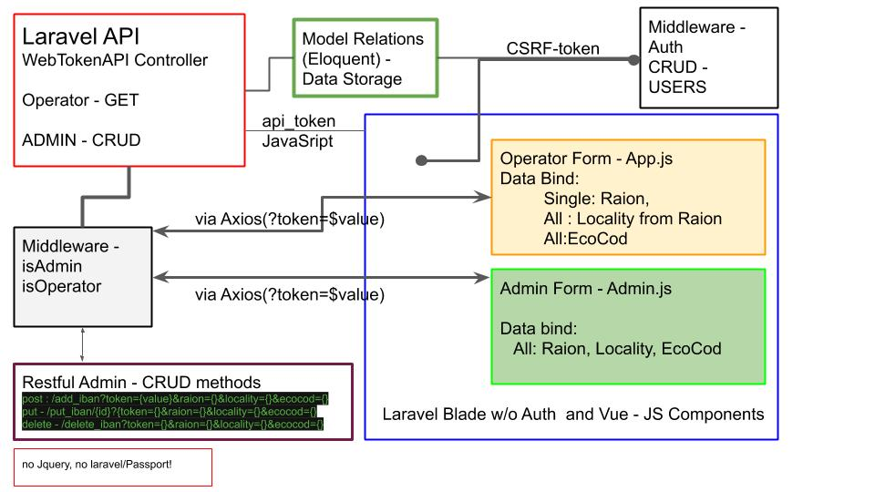

# <b> "IBAN generator"</b>

  
Made in Laravel eloquent and Json resources, on Vue form frontend with axios.

## About Project:

- Is a demo with reactive Vue form Frontend without Jquery.
- Backend is based on query seeds, and eloquent model dependency.
- Data extraction for internal Api.
- Implementation for CSV Seeders. 

## Project goals:

- Develop a DEMO solution witch have an example from "https://mf.gov.md/ro/iban"
- Implement authorization with roles for various users.
- Seeds from CSV.
- Form with data filtering.

## Installing instruction:

- git clone  "https://github.com/djpolmd/iban.git"
                or 'git fetch' (in case you have .zip version)  
- 'composer install'
- 'npm install'
- 'cp .env.example .env' - ! ( and set you .env file to mysql credentials) 
- 'php artisan migrate'
- 'php db:seed'
- 'npm run dev/prod'

## CRUD - Routes for internal API:

by default:
admin token=06a4f88B6ig21285r2VUKjT05S3bxTMUNMwy0ad5ZlZkAWj5Vz34Rzev6bBG

Admin CRUD routes:
GET http://iban.test/api/get_iban?token={token}
POST http://iban.test/api/add_iban/{IBAN}?token={token}

Example of request for admin form:
GET IBAN -
http://iban.test/api/get_iban?token=06a4f88B6ig21285r2VUKjT05S3bxTMUNMwy0ad5ZlZkAWj5Vz34Rzev6bBG
                                &ecocod=114418
                                &raion=1200
                                &locality=8733

post - /api/add_iban?token={value}&raion={}&locality={value}&ecocod={value}
put - /api/put_iban/{id}?{token={value}&raion={value}&locality={value}&ecocod={value}
delete - /api/delete_iban?token={value}&raion={value}&locality={value}&ecocod={value}

 

